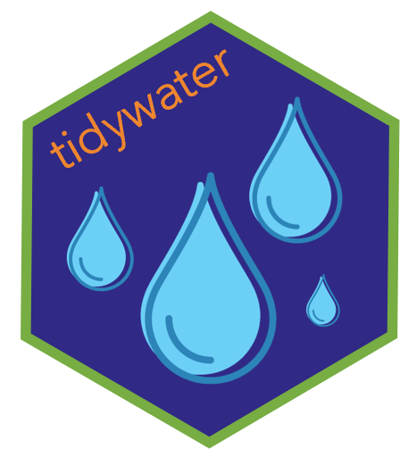

<!-- README.md is generated from README.Rmd. Please edit that file -->

```{r, include = FALSE}
knitr::opts_chunk$set(
  collapse = TRUE,
  comment = "#>",
  fig.path = "man/figures/README-"
)
```

# tidywater 

<!-- badges: start -->
[](https://github.com/BrownandCaldwell-Public/tidywater/actions/workflows/R-CMD-check.yaml)
<!-- badges: end -->

## Overview 

Tidywater incorporates published water chemistry and empirical models in a standard format.
The modular functions allow for building custom, comprehensive drinking water treatment processes. 
Functions are designed to work in a [tidyverse](https://www.tidyverse.org/) workflow. 

## Installation


``` r
# Install tidywater from CRAN:
install.packages("tidywater")

# Alternatively, install the development version from GitHub:
# install.packages("devtools")
devtools::install_github("BrownandCaldwell-Public/tidywater")
```

## Examples

In this first example, acid-base chemistry and TOC removal models are demonstrated. This example 
uses tidywater base functions to model a single water quality scenario.

```{r example, message = FALSE, setup = TRUE}
library(tidywater)
library(tidyverse)
## Use base tidywater functions to model water quality for a single scenario.
base_coagulation <- define_water(ph = 8, alk = 90, tds = 50, toc = 3, doc = 2.8, uv254 = 0.08) %>%
  chemdose_ph(alum = 30) %>%
  chemdose_toc(alum = 30)
```

To model multiple water quality scenarios, use `_df` helper functions to 
apply the models to a dataframe.

```{r}
## x_df functions apply models to a list of "waters", and output a list of "waters" so that
## the data can be piped into the next tidywater model.
coagulation <- water_df %>%
  define_water_df(output_water = "raw") %>%
  mutate(alum = 30) %>%
  chemdose_ph_df(input_water = "raw", output_water = "phchange") %>%
  # To get relevant parameters as separate columns, use pluck_cols argument
  chemdose_toc_df(input_water = "phchange", output_water = "coag", pluck_cols = TRUE)

## To get out other individual parameters, use `pluck_water`
coagulation <- coagulation %>%
  pluck_water(input_waters = c("raw", "coag"), parameter = c("hco3", "co3"))
```

Note that these functions use a "water" class. The "water" class is the foundation of the package; 
it provides a mechanism for linking models in any order while maintaining water quality information.
The `define_water` function takes water quality inputs, but `define_water_df` may be used to convert
a dataframe to a list of "waters".

For more detailed examples on tidywater functions and how to use "water" class data, please see 
the tidywater vignettes: `browseVignettes("tidywater")`

## License

This work is dual-licensed under Apache 2.0 and GPL 2.0 (or any later version).
You can choose between one of them if you use this work.

`SPDX-License-Identifier: Apache-2.0 OR MIT`

## Limitations
This project is maintained by volunteers and is provided without warranties or guarantees of any kind.  

Use at your own risk. For official support, please contact Brown and Caldwell. 

Please read our CONTRIBUTING.md and SECURITY.md before submitting issues or pull requests. 
